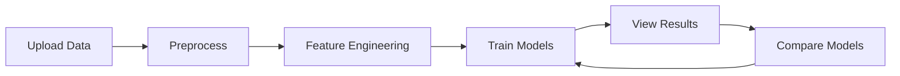

# Analytics Toolkit - Streamlit Web Interface

🎨 **Interactive web interface for the Analytics Toolkit** - A comprehensive ML platform with statistical rigor.

## 🚀 Quick Start

### Prerequisites
- Python 3.11+
- Poetry (for dependency management)
- Analytics Toolkit installed

### Installation & Launch

```bash
# Install dependencies (if not already done)
poetry install

# Launch the Streamlit app
poetry run streamlit run streamlit_app.py

# Or using Python directly
poetry run python -m streamlit run streamlit_app.py
```

The app will open automatically in your browser at `http://localhost:8501`

## 🎯 Features

### 📊 **Data Upload & Preview**
- **Drag-and-drop file upload** (CSV, Excel)
- **Interactive data exploration** with filtering and sorting
- **Automatic data profiling** and quality assessment
- **Missing value analysis** and distribution visualization
- **Sample dataset generation** for quick testing

### 🔧 **Data Preprocessing**
- **Intelligent preprocessing pipeline** with customizable options
- **Missing value handling** (multiple strategies)
- **Categorical encoding** (Label, One-Hot, Target, Frequency)
- **Feature scaling** (Standard, MinMax, Robust)
- **Outlier detection and handling** (IQR, Z-score, Isolation Forest)
- **Automated train-test splitting** with stratification

### 🔬 **Feature Engineering** *(Coming Soon)*
- Advanced transformations (Log, Box-Cox, outlier capping)
- Target encoding and Bayesian encoding
- Feature selection (Variance, Correlation, Mutual Information)
- Interaction detection and generation
- Temporal feature extraction

### 🧠 **Model Training**
- **PyTorch Statistical Regression** with full inference
- **Linear & Logistic Regression** with regularization options
- **Interactive hyperparameter tuning** with sliders and controls
- **Real-time training progress** and convergence monitoring
- **Comprehensive model validation** and performance metrics

### 📈 **Results Dashboard**
- **Interactive visualizations** with Plotly
- **Comprehensive diagnostic plots** (residuals, Q-Q plots, confusion matrices)
- **Feature importance analysis** with coefficient visualization
- **Statistical inference** (p-values, confidence intervals)
- **Performance metrics** and model insights

### ⚖️ **Model Comparison** *(Coming Soon)*
- Side-by-side model evaluation
- Performance benchmarking
- Statistical significance testing
- ROC curves and calibration plots

## 🎨 User Interface

### Navigation
The app uses a **sidebar navigation** with the following sections:

1. **🏠 Home** - Overview and quick start guide
2. **📊 Data Upload** - File upload and data exploration
3. **🔧 Preprocessing** - Data cleaning and preparation
4. **🔬 Feature Engineering** - Advanced feature transformations
5. **🧠 Model Training** - Train PyTorch statistical models
6. **📈 Results Dashboard** - Comprehensive results analysis
7. **⚖️ Model Comparison** - Compare multiple models

### Workflow


## 💡 Usage Examples

### Basic Workflow
1. **Upload Data**: Start by uploading a CSV/Excel file
2. **Explore**: Use the data preview and exploration tools
3. **Preprocess**: Configure preprocessing options (scaling, encoding, etc.)
4. **Train**: Select and configure a model (Linear/Logistic Regression)
5. **Analyze**: View comprehensive results and diagnostics
6. **Iterate**: Adjust parameters and retrain for better performance

### Sample Data
The app includes **sample dataset generators**:
- **Regression Dataset**: 1000 samples, 8 features + categorical variables
- **Classification Dataset**: 1000 samples, 10 features + categorical variables

## 🛠️ Technical Details

### Architecture
- **Frontend**: Streamlit with Plotly for visualizations
- **Backend**: Analytics Toolkit (PyTorch + scikit-learn)
- **State Management**: Streamlit session state
- **Visualization**: Plotly Express and Graph Objects

### Performance Features
- **Lazy loading** of modules for faster startup
- **Session state management** for data persistence
- **Error handling** with graceful fallbacks
- **Progress indicators** for long-running operations

### Supported File Formats
- **CSV** files (UTF-8, Latin-1 encoding)
- **Excel** files (.xlsx, .xls)
- **Maximum file size**: 200MB

## 🚧 Current Limitations

- Feature Engineering UI is placeholder (core functionality available via API)
- Model Comparison UI is placeholder (single model analysis available)
- AutoML integration not yet exposed in UI
- No model export/import functionality yet

## 🔧 Configuration

### Environment Variables
```bash
# Optional: Set custom port
export STREAMLIT_PORT=8501

# Optional: Set custom host
export STREAMLIT_HOST=localhost
```

### Streamlit Configuration
Create `.streamlit/config.toml` for custom settings:
```toml
[server]
port = 8501
headless = false
enableCORS = false

[theme]
primaryColor = "#FF6B6B"
backgroundColor = "#FFFFFF"
secondaryBackgroundColor = "#F0F2F6"
```

## 📱 Mobile Support

The interface is **responsive** and works on mobile devices, though desktop experience is recommended for optimal usability.

## 🐛 Troubleshooting

### Common Issues

**1. Import Errors**
```bash
# Ensure all dependencies are installed
poetry install

# Check if Analytics Toolkit modules are available
poetry run python -c "import analytics_toolkit; print('✅ Success')"
```

**2. File Upload Issues**
- Check file format (CSV/Excel only)
- Ensure file size < 200MB
- Try different encoding if CSV fails to load

**3. Model Training Fails**
- Verify data preprocessing completed successfully
- Check for missing values or invalid data
- Try CPU device if GPU issues occur

**4. Visualization Problems**
- Update browser if plots don't render
- Check JavaScript is enabled
- Try refreshing the page

### Getting Help
- **Documentation**: Check the main Analytics Toolkit docs
- **Issues**: Report bugs on GitHub
- **Feature Requests**: Use GitHub issues with enhancement label

## 🚀 Future Enhancements

### Planned Features
- **Advanced Feature Engineering UI** with interactive transformations
- **Complete Model Comparison** with statistical testing
- **AutoML Integration** with automated pipelines
- **Model Deployment** with API generation
- **Data Export** capabilities (processed datasets, model artifacts)
- **User Authentication** and project management
- **Cloud Deployment** options (AWS, GCP, Azure)

### Performance Improvements
- **Caching** for expensive computations
- **Async processing** for long-running tasks
- **Progressive loading** for large datasets
- **GPU acceleration** UI controls

---

## 🎯 Quick Commands

```bash
# Launch app
poetry run streamlit run streamlit_app.py

# Launch with custom port
poetry run streamlit run streamlit_app.py --server.port 8502

# Launch in headless mode (for deployment)
poetry run streamlit run streamlit_app.py --server.headless true

# Clear cache and restart
poetry run streamlit run streamlit_app.py --server.runOnSave true
```

---

**🧬 Analytics Toolkit Streamlit Interface** - *Making advanced ML accessible through intuitive web interfaces*